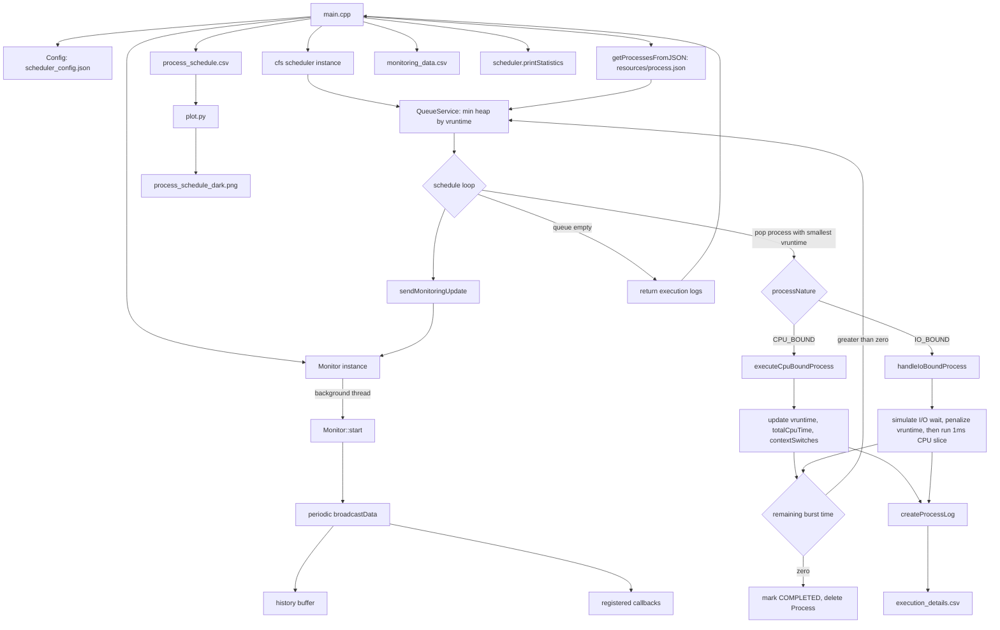

# CFS Scheduler with Real Time Monitoring

<p align="center">


</p>

## 1. Overview

This project is a simulation of the Linux Completely Fair Scheduler (CFS). It loads a set of synthetic processes from a JSON file, schedules them using a virtual runtime (vruntime) ordered min heap, executes each process for one scheduling event at a time (either a CPU burst or an I/O wait followed by a small CPU burst), records every scheduling decision, streams live statistics through a background monitoring thread, and finally writes the results to CSV and log files for offline inspection with `plot.py`.

The codebase is intentionally organized the way a small operating system component would be organized in production C++: a configuration layer, a core process model, a scheduling engine, a monitoring subsystem, and a set of shared utilities.

## 2. High Level Architecture



## 3. Program Workflow

The program executes the following sequence every time it is run.

1. `main.cpp` prints a banner and constructs a `Config` object from `scheduler_config.json`. If the file is missing, hard coded defaults inside `SchedulerConfig`, `MonitorConfig`, `LoggingConfig`, and `StatsConfig` are used instead.
2. `getProcessesFromJSON` reads `resources/process.json`, validates that the root element is a JSON array, and allocates one heap `Process` object per entry. Each process starts in the `READY` state.
3. A `cfs` scheduler object and a `Monitor` object are constructed from the loaded configuration.
4. A callback is registered on the monitor so that every tenth update prints a single line progress summary to the console.
5. The monitor is started on its own `std::thread`, sleeping for `update_interval_ms` between broadcasts, keeping a rolling history capped at `max_history` entries.
6. `cfs::schedule` pushes every process into a `QueueService`, which is a `std::priority_queue` configured as a min heap on `vruntime` (ties are broken by lower priority number first).
7. The main scheduling loop repeatedly pops the process with the smallest vruntime, marks it `RUNNING`, and dispatches it to `executeCpuBoundProcess` or `handleIoBoundProcess` depending on `processNature`.
8. Each executed process either gets requeued (if `cpu_burst_time` is still greater than zero) or is marked `COMPLETED` and freed. Every event is written to `execution_details.csv` and, on the configured interval, forwarded to the monitor.
9. When the queue is empty the loop ends, the monitor thread is stopped and joined, `process_schedule.csv` and `monitoring_data.csv` are written, aggregate statistics are printed, and all remaining heap memory is released.
10. `plot.py` can be run afterwards to turn `process_schedule.csv` into a dark themed Gantt style visualization saved as `process_schedule_dark.png`.

## 4. Directory Structure

```
.
├── CMakeLists.txt
├── main.cpp
├── scheduler_config.json
├── scheduler_config_explain.txt
├── plot.py
├── resources
│   └── process.json
└── src
    ├── config
    │   ├── config.hpp
    │   └── config.cpp
    ├── core
    │   ├── processService.hpp
    │   ├── processService.cpp
    │   └── processLog.hpp
    ├── monitoring
    │   ├── monitor.hpp
    │   └── monitor.cpp
    ├── scheduling
    │   ├── queueService.hpp
    │   ├── queueService.cpp
    │   ├── cpuBoundProcessExecution.hpp
    │   ├── cpuBoundProcessExecution.cpp
    │   ├── ioBoundProcessExecution.hpp
    │   ├── ioBoundProcessExecution.cpp
    │   ├── cfs.hpp
    │   └── cfs.cpp
    └── utils
        ├── logger.hpp
        ├── logger.cpp
        └── timer.hpp
```

## 5. Core Data Model (`src/core`)

### 5.1 `Process` (`processService.hpp`)

`Process` is the central struct passed by raw pointer throughout the scheduler. Its scheduling relevant fields are:

`pid` is the unique identifier used everywhere for logging and CSV output. `vruntime` is a signed 64 bit virtual runtime, the single number that determines scheduling order. `cpu_burst_time` is the remaining CPU work in milliseconds, decremented on every execution and used as the completion condition. `io_burst_time` is currently loaded from JSON but not consumed by the execution paths. `priority` is an integer where 1 is the highest priority; it feeds into the weight formula and breaks vruntime ties in the queue comparator. `state` is a `ProcessStateData` holding a `ProcessState` enum (`READY`, `RUNNING`, `BLOCKED_IO`, `COMPLETED`, `WAITING`) plus a `lastStateChange` timestamp. `processNature` selects between `CPU_BOUND` and `IO_BOUND` execution paths.

Bookkeeping fields (`totalCpuTime`, `totalWaitTime`, `totalIoTime`, `contextSwitches`, `lastScheduled`, `arrivalTime`) accumulate statistics that are later reported by `cfs::printStatistics` and streamed by the monitor.

### 5.2 JSON loading (`processService.cpp`)

`stringToProcessNature` maps the strings `"CPU_BOUND"` and `"IO_BOUND"` onto the enum and throws `std::invalid_argument` for anything else. `getProcessesFromJSON` opens the file, parses it with nlohmann json, verifies the root is an array, and for every element reads `pid`, `vruntime`, `cpu_burst_time`, `priority`, and `processNature` as required fields, with `io_burst_time` defaulting to zero when absent. Every process is initialized to the `READY` state before being returned in a `std::vector<Process*>`. Ownership of these pointers transfers to whoever calls this function; in this project that ownership is later handed to the `cfs` scheduler, which deletes each process when it completes.

### 5.3 `ProcessLog` (`processLog.hpp`)

A lightweight record of a single execution episode containing `pid`, `startTime`, and `endTime`. The scheduler allocates one of these per event and returns the full vector to `main.cpp`, which serializes them into `process_schedule.csv` and then deletes them (the scheduler itself does not own execution logs, only processes).

## 6. Configuration Layer (`src/config`)

`Config` wraps four plain structs, `SchedulerConfig`, `MonitorConfig`, `LoggingConfig`, and `StatsConfig`, each carrying sensible defaults so the binary can run even without a configuration file on disk.

`Config::loadFromFile` opens `scheduler_config.json`, and for each top level key present it reads individual fields with `json::value(key, default)`, meaning any field omitted in the file simply falls back to the struct default rather than causing an error. After parsing the logging section it immediately calls `Logger::setLevel` and `Logger::enable`, wiring configuration straight into the singleton logger. `Config::save` performs the inverse operation, serializing the current in-memory configuration back to a pretty printed JSON file. `Config::print` writes a human readable summary of every section to standard output, which is what appears immediately after the program banner.

The shipped `scheduler_config.json` sets a 2 millisecond CPU time slice, a 10 millisecond simulated I/O wait, the canonical Linux `nice_0_load` of 1024, preemption enabled, a 1 millisecond minimum granularity, monitoring polling every 100 milliseconds with a history cap of 1000 samples, INFO level logging to `scheduler.log`, and statistics output to `stats.json`. `scheduler_config_explain.txt` is a commented mirror of the same file kept purely for human reference, since standard JSON does not support comments.

## 7. Scheduling Engine (`src/scheduling`)

### 7.1 `QueueService` (`queueService.hpp` / `.cpp`)

`QueueService` wraps a `std::priority_queue<Process*, std::vector<Process*>, Compare>`. The `Compare` functor implements a min heap: when two processes have equal `vruntime`, the one with the lower `priority` value (meaning higher scheduling priority) sorts first; otherwise the process with the smaller `vruntime` sorts first. `push`, `pop`, `top`, `empty`, and `size` proxy directly to the underlying heap, while `push` additionally tracks `totalPushed` and `maxSize` for later reporting. The corresponding `.cpp` file only exists to give the build system a translation unit, since the class itself is entirely header defined.

### 7.2 Weight function and CPU bound execution (`cpuBoundProcessExecution.hpp` / `.cpp`)

`weightFunction(priority)` computes `NICE_0_LOAD / (priority + 1)` as a double, so lower priority numbers (higher scheduling priority) yield a larger weight. `executeCpuBoundProcess` runs one scheduling event for a CPU bound process: it computes `executedTime` as the minimum of the configured time slice and the process's remaining `cpu_burst_time`, subtracts that from `cpu_burst_time`, computes the weight from the process's priority, and increases `vruntime` by `(executedTime * NICE_0_LOAD) / weight`. Because weight is inversely tied to priority, higher priority processes accumulate vruntime more slowly and therefore get reselected by the min heap sooner. The function then updates `totalCpuTime` and `contextSwitches`, logs a debug line, and either requeues the process (work remains) or marks it `COMPLETED`, logs an info line, and deletes the heap allocated `Process`.

### 7.3 I/O bound execution (`ioBoundProcessExecution.hpp` / `.cpp`)

`handleIoBoundProcess` models a process that blocks on I/O before doing a small amount of CPU work. It sets the process state to `BLOCKED_IO`, sleeps the calling thread for `ioWaitTime` milliseconds using `std::this_thread::sleep_for` to simulate the wait, measures the actual elapsed duration with `std::chrono::steady_clock`, restores the state to `READY`, and adds a vruntime penalty of `(ioDuration * NICE_0_LOAD) / weight`. This penalty is what stops I/O bound processes from being scheduled indefinitely just because they rarely use the CPU. After the penalty is applied, the function executes a fixed one millisecond CPU portion, decrementing `cpu_burst_time` and adding a second, smaller vruntime increment for that CPU time, then updates statistics and either requeues or completes the process exactly like the CPU bound path.

### 7.4 `cfs` orchestrator (`cfs.hpp` / `.cpp`)

The `cfs` class owns a `Config`, a `QueueService`, a vector of `ProcessLog*`, an internal `Statistics` struct (atomic counters for context switches, total CPU time, total I/O time, total wait time, plus per process maps), a pointer to the currently running `Process`, an `Monitor*` for streaming updates, and a running flag.

`cfs::schedule` is the heart of the simulation. It opens `execution_details.csv` and writes a header row, then pushes every incoming process into the queue while stamping its `arrivalTime` and logging a summary line per process. The main loop repeats while the queue is non-empty and the scheduler has not been stopped: it pops the process with the smallest vruntime, transitions it to `RUNNING`, records a start timestamp, and dispatches to `executeCpuBoundProcess` or `handleIoBoundProcess` based on `processNature`. After execution it records an end timestamp, updates context switch and CPU time statistics if the process is not yet completed, appends a `ProcessLog`, writes a detailed row to `execution_details.csv`, and, whenever enough time has elapsed since the last update, calls `sendMonitoringUpdate`. The process is either requeued in `READY` state or, if completed, logged as finished. Once the loop exits, the function closes the detail log, pushes a final empty monitoring snapshot, logs an execution summary grouped by pid, and returns the accumulated `ProcessLog` vector.

`sendMonitoringUpdate` builds a `MonitorData` snapshot containing the current timestamp, the pid of the process currently running, the queue size, cumulative context switches and CPU time, a filtered copy of the still pending processes (defensive against corrupted or freed pointers by checking `pid` is within a sane range), and a per process CPU time map, then forwards it to `Monitor::update`. Building this snapshot requires temporarily draining and refilling the priority queue since `std::priority_queue` does not support iteration.

`printStatistics` prints total context switches, total CPU time, total I/O time, the number of execution log entries, and a per process CPU time breakdown to standard output. `getCurrentTimeMs` is a thin wrapper around `Timer::currentTimeMs`.

## 8. Monitoring Subsystem (`src/monitoring`)

`MonitorData` is the payload broadcast on every tick: a timestamp, the currently running pid, the queue size, a snapshot vector of pending processes, cumulative context switches and CPU time, and a per process CPU time map.

`Monitor` owns a `MonitorConfig`, an atomic running flag, a `std::thread`, a `std::mutex` protecting the current data, the current `MonitorData` itself, a bounded history vector, and a list of `std::function<void(const MonitorData&)>` callbacks.

`Monitor::start` spawns a background thread that sleeps for `updateIntervalMs`, then under a lock guard broadcasts the current data to every registered callback and appends it to `history`, trimming the oldest entry once `maxHistory` is exceeded. `Monitor::update` is the thread safe entry point the scheduler uses to push new data in. `Monitor::registerCallback` appends a callback, which in `main.cpp` is used to print a single status line to the console every tenth tick. `Monitor::broadcastData` wraps each callback invocation in a try/catch so a misbehaving callback cannot crash the monitoring thread. `Monitor::saveToFile` writes the full history to a CSV file with columns `timestamp,currentProcess,queueSize,contextSwitches,totalCpuTime`. `Monitor::stop` flips the running flag and joins the thread, which is invoked from `main.cpp` after scheduling finishes and again automatically from the destructor as a safety net.

## 9. Utilities (`src/utils`)

### 9.1 `Logger` (`logger.hpp` / `.cpp`)

`Logger` is a thread safe singleton (Meyer's singleton pattern, `getInstance` returning a function local static) that opens `scheduler.log` in append mode on first use. Its private `log` method filters messages against a priority table (`DEBUG` 0, `INFO` 1, `WARNING` 2, `ERROR` 3) compared against the currently configured `logLevel`, locks a mutex, timestamps the message, writes it to standard output, and, if enabled, flushes it to the log file immediately. The public static methods `debug`, `info`, `warning`, and `error` are the interface used everywhere else in the codebase, alongside `setLevel` and `enable`, which `Config::loadFromFile` calls to apply the values read from `scheduler_config.json`. The associated `.cpp` file exists only to give the build system a compiled translation unit since the class is header only.

### 9.2 `Timer` (`timer.hpp`)

`Timer` wraps `std::chrono::steady_clock` to provide monotonic, wraparound free timing. `start` records a start point (note that it also resets `running` to false rather than true, which means `elapsedMs`/`elapsedNs` will read from the stored `endTime` rather than the live clock unless `stop` was previously called; this is a known quirk of the current implementation). `stop` records an end point when `running` is true. `elapedMs` and `elapsedNs` report elapsed time either from now (if still running) or between the stored start and end points. `currentTimeMs` and `currentTimeNs` are static helpers that return the steady clock's time since epoch, and this is what `cfs::getCurrentTimeMs` calls for all scheduling timestamps.

## 10. Entry Point (`main.cpp`)

`main` prints a banner, loads and prints the configuration, loads processes from `../resources/process.json` (the relative path assumes the binary is executed from inside a `build` directory one level below the project root), constructs the `cfs` scheduler and `Monitor`, registers a throttled console progress callback, launches the monitor on a dedicated thread, runs `scheduler.schedule`, stops and joins the monitor thread, writes `process_schedule.csv` from the returned execution logs, calls `monitor.saveToFile("monitoring_data.csv")`, prints final statistics, clears the process vector (ownership was transferred into the scheduler, which already deleted each process on completion, so this only prevents an accidental double free), deletes the execution logs (which the scheduler does not own), and returns 0.

## 11. Build Instructions

The project uses CMake 3.10 or newer and requires a C++17 compiler with pthread support.

```
mkdir build
cd build
cmake ..
cmake --build .
```

`CMakeLists.txt` refuses in source builds, sets the C++ standard to 17, enables `-Wall -Wextra -pthread`, adds `src/` and `include/` (for the bundled `nlohmann/json.hpp`) to the include path, globs every `.cpp` file under `src/` together with `main.cpp`, links against `Threads::Threads`, and produces an executable named `cfs_scheduler`.

## 12. Running the Simulation

```
cd build
./cfs_scheduler
```

Because `main.cpp` opens `../resources/process.json`, the binary should be executed from inside the `build` directory as created above. On completion the following artifacts appear in `build`, matching the entries ignored by `.gitignore`.

`scheduler.log` contains the full timestamped log of every scheduling decision. `execution_details.csv` contains a detailed per event trace with columns for event number, pid, start and end time, duration, vruntime, priority, remaining burst, resulting state, and process nature. `process_schedule.csv` contains the simplified pid, start_time, end_time timeline consumed by `plot.py`. `monitoring_data.csv` contains the periodic monitor snapshots. `stats.json` is reserved as the configured statistics output path, referenced in configuration but not currently written by the code; only console output via `printStatistics` is produced today.

## 13. Visualizing the Schedule

```
python3 -m venv myenv
source myenv/bin/activate
pip install pandas matplotlib
python3 plot.py
```

`plot.py` loads `process_schedule.csv` with pandas, applies a dark matplotlib theme, and draws one horizontal bar per execution episode, colored by `pid` modulo an eight color high contrast palette, producing `process_schedule_dark.png`, a Gantt style timeline of which process ran during which time window.

## 14. Input Schema (`resources/process.json`)

Each entry in the array must provide `pid` (integer), `vruntime` (integer, the initial virtual runtime), `cpu_burst_time` (integer milliseconds of CPU work required), `priority` (integer, 1 is highest), and `processNature` (the string `CPU_BOUND` or `IO_BOUND`). An optional `io_burst_time` integer may also be supplied and defaults to zero. The bundled file provides twenty sample processes with a mix of natures and priorities suitable for observing fairness and priority interaction in the scheduler output.

## 15. Scheduling Algorithm Summary

The scheduler always selects the process with the smallest vruntime from the min heap, matching CFS's core fairness property of favoring whichever task has received proportionally the least CPU time so far. Weight is derived from priority as `1024 / (priority + 1)`, so a priority 1 process has roughly twice the weight of a priority 3 process, causing its vruntime to grow roughly half as fast for the same amount of executed time, which in turn causes it to be rescheduled more often. I/O bound processes receive an additional vruntime penalty proportional to the time they spent blocked, which keeps them from monopolizing the queue purely by virtue of frequently yielding the CPU. This combination of vruntime ordering, priority weighted growth, and I/O penalty is what produces CFS style fairness across a mixed workload of CPU bound and I/O bound processes with differing priorities.
